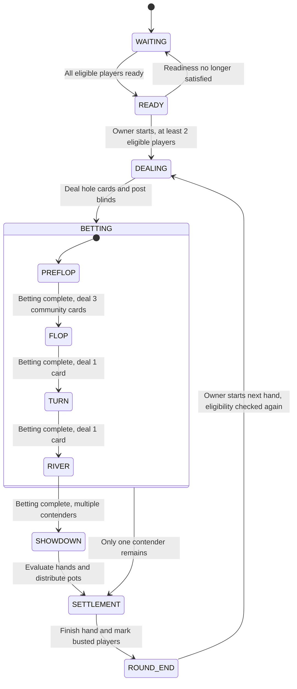

# Poker State Machine — Design and Source Code

The poker engine controls how a hand moves from dealing to betting, showdown, and settlement.
The server decides whether an action is legal and when the game advances; the browser displays
the resulting events and viewer-specific snapshots. The following examples are excerpts from
the current Java implementation, with links to the complete source files.

## 1. Separate the session, the hand, and the betting round

| Component | Responsibility | Source |
| --- | --- | --- |
| `GameSession` | Keeps room membership and readiness, checks the owner's start request, rotates the dealer button, and creates a new hand. | [GameSession.java](../backend/src/main/java/com/xidao/poker/engine/game/GameSession.java) |
| `Hand` | Owns the deck, community cards, phase transitions, showdown, and settlement for one hand. | [Hand.java](../backend/src/main/java/com/xidao/poker/engine/game/Hand.java) |
| `BettingRound` | Validates betting actions, tracks bets and raise requirements, selects the next actor, and determines when a betting round is complete. | [BettingRound.java](../backend/src/main/java/com/xidao/poker/engine/table/BettingRound.java) |
| `Player` | Tracks connection, seat, and hand status separately, and defines whether the player can act or still contest a pot. | [Player.java](../backend/src/main/java/com/xidao/poker/engine/player/Player.java) |
| `HandEvaluator` / `PotManager` | Finds each contender's best five-card hand and distributes the main pot and side pots. | [HandEvaluator.java](../backend/src/main/java/com/xidao/poker/engine/eval/HandEvaluator.java) / [PotManager.java](../backend/src/main/java/com/xidao/poker/engine/pot/PotManager.java) |

A session can contain many consecutive hands. Creating a new `Hand` resets the hand-specific
state, while the session keeps the players and their remaining chips. These engine classes
do not depend on Spring or WebSocket. Room commands and timers enter the serialized
application-layer execution path before changing the engine state.

## 2. Phases and transitions

The phase definition comes from [GamePhase.java](../backend/src/main/java/com/xidao/poker/engine/game/GamePhase.java):

```java
public enum GamePhase {
    WAITING,
    READY,
    DEALING,
    PREFLOP,
    FLOP,
    TURN,
    RIVER,
    SHOWDOWN,
    SETTLEMENT,
    ROUND_END;

    public boolean isBettingPhase() {
        return this == PREFLOP || this == FLOP || this == TURN || this == RIVER;
    }
}
```



`BETTING` is a grouping used in this diagram, not an extra enum value. Before the first
hand, `GameSession.phase()` derives `WAITING` or `READY` from player readiness. Once a
hand exists, it reports that hand's phase; after settlement it stays at `ROUND_END` until
the owner starts another eligible hand. Poker does not automatically start a new hand here.

## 3. Advancing without waiting for impossible actions

This method in `Hand` runs when the current betting round is complete:

```java
private void advanceAutomaticallyIfNeeded() {
    while (phase.isBettingPhase() && bettingRound != null && bettingRound.isComplete()) {
        if (contenders().size() <= 1) {
            settleWithoutShowdown();
            return;
        }
        switch (phase) {
            case PREFLOP -> openCommunityStreet(GamePhase.FLOP, 3);
            case FLOP -> openCommunityStreet(GamePhase.TURN, 1);
            case TURN -> openCommunityStreet(GamePhase.RIVER, 1);
            case RIVER -> {
                showdownAndSettle();
                return;
            }
            default -> throw new IllegalStateException("unexpected betting phase " + phase);
        }
    }
    if (phase.isBettingPhase() && bettingRound != null && !bettingRound.isComplete()) {
        emitTurnChanged();
    }
}
```

Each new community-card street resets street bets, burns a card, deals the required cards,
and opens a new `BettingRound`. The loop continues only while that round is already complete.
If everyone remaining is all-in, it runs out the board through the remaining streets and
then settles at showdown. It does not ask all-in players to act or compare incomplete boards.

`BettingRound.isComplete()` also handles the case where only one player can still act:
if that player's bet already matches the current bet, there is no need to request a
meaningless check against all-in opponents. If chips are still owed, the engine waits for
that player's response. When everyone else folds, settlement can happen without showdown.

## 4. Preventing disconnected players and spectators from blocking the game

An earlier design grouped disconnected players and players without chips under a spectator
identity. Turn selection could still reach one of these players even though they had no legal
action, leaving the table stuck. The current implementation separates three independent states:

| Dimension | Values |
| --- | --- |
| Connection | `CONNECTED`, `DISCONNECTED` |
| Seat | `SEATED`, `SPECTATOR`, `BUSTED` |
| Current hand | `NOT_IN_HAND`, `ACTIVE`, `FOLDED`, `ALL_IN` |

The two predicates in `Player` deliberately answer different questions:

```java
public boolean canAct() {
    return connectionStatus == ConnectionStatus.CONNECTED
            && seatStatus == SeatStatus.SEATED
            && handStatus == HandStatus.ACTIVE;
}

public boolean isInHand() {
    return handStatus == HandStatus.ACTIVE || handStatus == HandStatus.ALL_IN;
}
```

A disconnected all-in player cannot act, but remains a contender. Eligibility to win an
individual side pot additionally depends on that player's contribution. In this implementation,
disconnecting while still active forfeits the current hand; reconnecting restores the connection,
not the forfeited action rights. A player who disconnects or leaves after going all-in retains
their current-hand pot eligibility until settlement.

The next-actor search in `BettingRound` uses the same action predicate:

```java
private Integer findNextRequiringAction(int afterSeat) {
    for (int offset = 1; offset <= maxSeats; offset++) {
        int candidate = Math.floorMod(afterSeat + offset, maxSeats);
        Player player = playerAt(candidate);
        if (player == null || !player.canAct()) continue;
        if (requiresAction(player)) return candidate;
    }
    return null;
}

private boolean requiresAction(Player player) {
    return player.canAct() && (!player.hasActed() || player.streetBet() < currentBet);
}
```

After a disconnect or another eligibility change, the betting round reconciles its actor.
A completed round advances; an incomplete round must have an eligible actor. `Hand` also
checks this invariant before exposing a turn, so the client is never expected to repair the
server's turn order.

## 5. Why I Do This

I started this project because I wanted to build a multiplayer game that my friends and I
could play together. As they tried it, their feedback shaped what I worked on next: clearer
controls, better visual feedback, and a game that could keep running when someone disconnected.
Having people actually use the project made these problems concrete.

My guiding principle is to put players first. I want my friends to enjoy the game without having to work around its technical problems. That sometimes means spending more time revising controls, improving feedback, or reworking logic that seemed finished. I am willing to take on that extra work because a feature is not complete just because it runs—it also needs to make sense to the person using it.

The stalled-turn problem described above changed how I approached the game's logic. Refreshing
the page could get a player back into the room, but it did not explain why the game had asked
someone who could not act to take a turn. I wanted the underlying design to handle that
situation consistently. Separating connection, seat, and hand status gave each condition a
clear meaning, including the important case of an all-in player who disconnects but still
has a right to win chips.

I use AI coding tools to help implement project. My role includes defining the
behaviour I want, discussing design choices, testing with friends, debugging the project and using the results to
guide revisions. Writing this document is also a way for me to explain the reasoning behind
the implementation, beyond showing that the game runs.

Over time, the project has grown beyond poker into a platform with another multiplayer game
and shared account features. I would eventually like to build an original world and characters
around it. For now, I want to keep improving the games people can already play, and learn how
to make each new feature fit into a reliable and swift system.

[Back to project README](../README.md)
